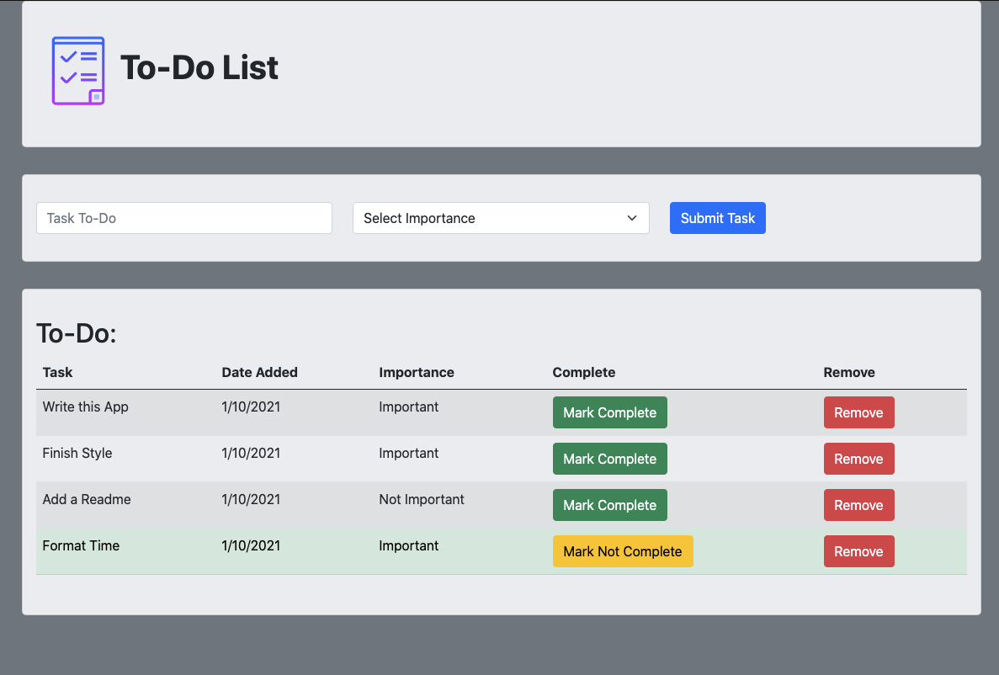

# To-Do List

## Description

To-Do List is a simple to-do list app that allows the user to create tasks and set their importance, mark them as completed or not completed, and remove them from the list. The app will track the date an individual task was added and completion status, and all tasks are stored on a database until deleted by the user.

## Screen Shot

## Built With

HTML 5, CSS 3, Javascript, jQuery 3.5, Bootstrap 5, Node.js, Express, PostgreSQL

## Acknowledgement
Thanks to [Prime Digital Academy](http://www.primeacademy.io) who equipped and helped me to make this application a reality.

## Support
If you have suggestions or issues, please email me at dunnmj42@gmail.com